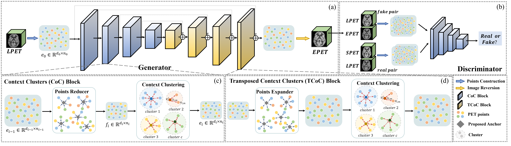

# PCC-GAN
<summary>
  <b>Image2Points: A 3D Point-based Context Clusters GAN for High-Quality PET Image Reconstruction</b>, ICASSP 2024.
  <a href="https://ieeexplore.ieee.org/document/10446360" target="blank">[link]</a>
</summary>

<summary>
   The extension of this work (PMC<sup>2</sup>-GAN): <b>3D Point-based Multi-Modal Context Clusters GAN for Low-Dose PET Image Denoising</b>, TCSVT 2024.
  <a href="https://ieeexplore.ieee.org/abstract/document/10526270" target="blank">[link]</a>
</summary>

## Introduction
### PCC-GAN


<p style="text-align:justify">To obtain high-quality Positron emission tomography (PET) images while minimizing radiation exposure, numerous methods have been proposed to reconstruct standard-dose PET (SPET) images from the corresponding low-dose PET (LPET) images. However, these methods heavily rely on voxel-based representations, which fall short of adequately accounting for the precise structure and fine-grained context, leading to compromised reconstruction. In this paper, we propose a 3D point-based context clusters GAN, namely PCC-GAN, to reconstruct high-quality SPET images from LPET. Specifically, inspired by the geometric representation power of points, we resort to a point-based representation to enhance the explicit expression of the image structure, thus facilitating the reconstruction with finer details. Moreover, a context clustering strategy is applied to explore the contextual relationships among points, which mitigates the ambiguities of small structures in the reconstructed images. Experiments on both clinical and phantom datasets demonstrate that our PCC-GAN outperforms the state-of-the-art reconstruction methods qualitatively and quantitatively.</p>

### PMC<sup>2</sup>-GAN


<p style="text-align:justify">The extensions are elaborated in the following aspects: (1) We refined the research background to rigorously state the necessity of effectively integrating the metabolic information in PET images and the anatomical structural information in MRI images as well as the advantages of multi-modality PET image denoising. (2) We innovatively designed Cross-CC blocks to efficiently harness the multi-modal inputs. In Cross-CC blocks, we developed cross-points aggregating and dispatching to dynamically balance the importance of the primary PET and the auxiliary MRI modalities to generate the target SPET images while maintaining an awareness of the structural and contextual relationships. Then, we elaborately integrated the Cross-CC blocks with the Self-CC blocks to construct the MultiMCC blocks, effectively extracting and integrating the information from both modalities in a structurally explicit and contextually rich manner while maximizing the knowledge in the primary PET modality.</p>

## Installation and Training
Clone this repository:
```bash
git clone https://github.com/gluucose/PCCGAN.git
```
Install the required libraries:
```bash
pip install -r requirements.txt
``` 

<p style="text-align:justify">Before training, prepare your data in the dataset folder. Note that, in the model folder, 
context_cluster3D.py is the generator for PCC-GAN (single modality), 
whereas context_cluster3D_Multi.py is the generator for PMC<sup>2</sup>-GAN (multi-modality).
The training code is for PMC<sup>2</sup>-GAN with mutli-modality inputs. To train the model, you can run: </p>

```bash
python train.py
```

## Acknowledgements
We would like to thank the authors of following repositories for their great works:
- [Context-Cluster (CoCs)](https://github.com/ma-xu/Context-Cluster)

## Citation 
If you find our work useful in your research, please consider citing our papers at:
```bash
@inproceedings{cui2024image2points,
  title={Image2Points: A 3D Point-based Context Clusters GAN for High-Quality PET Image Reconstruction},
  author={Cui, Jiaqi and Wang, Yan and Wen, Lu and Zeng, Pinxian and Wu, Xi and Zhou, Jiliu and Shen, Dinggang},
  booktitle={ICASSP 2024 - 2024 IEEE International Conference on Acoustics, Speech and Signal Processing (ICASSP)}, 
  pages={1726-1730},
  year={2024},
  organization={IEEE}
  }
```
```bash
@article{cui20243d,
  title={3D Point-based Multi-Modal Context Clusters GAN for Low-Dose PET Image Denoising},
  author={Cui, Jiaqi and Wang, Yan and Zhou, Luping and Fei, Yuchen and Zhou, Jiliu and Shen, Dinggang},
  journal={IEEE Transactions on Circuits and Systems for Video Technology},
  year={2024},
  publisher={IEEE}
}
```

## Contact
If you have any questions or suggestions, feel free to email [Jiaqi Cui](jiaqicui2001@gmail.com).

